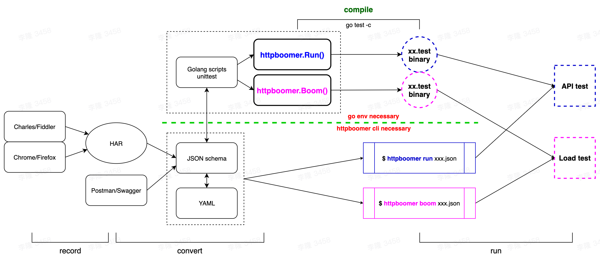

# HttpBoomer

[](https://pkg.go.dev/github.com/httprunner/httpboomer)
[](https://github.com/httprunner/HttpBoomer/actions)
[](https://codecov.io/gh/httprunner/HttpBoomer)
[](https://goreportcard.com/report/github.com/httprunner/HttpBoomer)
[](https://app.fossa.com/reports/fb0e64a7-7dcf-48bb-8de9-8f0e016b903b)

> HttpBoomer = [HttpRunner] + [Boomer]

HttpBoomer is a golang implementation of [HttpRunner]. Ideally, HttpBoomer will be fully compatible with HttpRunner, including testcase format and usage. What's more, HttpBoomer will integrate Boomer natively to be a better load generator for [locust].

## Key Features



- [x] Full support for HTTP(S) requests, more protocols are also in the plan.
- [x] Testcases can be described in multiple formats, `YAML`/`JSON`/`Golang`, and they are interchangeable.
- [ ] With [`HAR`][HAR] support, you can use Charles/Fiddler/Chrome/etc as a script recording generator.
- [x] Supports `variables`/`extract`/`validate`/`hooks` mechanisms to create extremely complex test scenarios.
- [ ] Built-in integration of rich functions, and you can also use [`go plugin`][plugin] to create and call custom functions.
- [x] Inherit all powerful features of [`Boomer`][Boomer] and [`locust`][locust], you can run `load test` without extra work.
- [x] Use it as a `CLI tool` or as a `library` are both supported.

## Quick Start

### Install

```bash
$ go get -u github.com/httprunner/httpboomer
```

### Examples

This is an example of HttpBoomer testcase. You can find more in the [`examples`][examples] directory.

```go
import (
    "testing"

    "github.com/httprunner/httpboomer"
)

func TestCaseDemo(t *testing.T) {
    testcase := &httpboomer.TestCase{
        Config: httpboomer.TConfig{
            Name:    "demo with complex mechanisms",
            BaseURL: "https://postman-echo.com",
            Variables: map[string]interface{}{ // global level variables
                "n":       5,
                "a":       12.3,
                "b":       3.45,
                "varFoo1": "${gen_random_string($n)}",
                "varFoo2": "${max($a, $b)}", // 12.3; eval with built-in function
            },
        },
        TestSteps: []httpboomer.IStep{
            httpboomer.Step("get with params").
                WithVariables(map[string]interface{}{ // step level variables
                    "n":       3,                // inherit config level variables if not set in step level, a/varFoo1
                    "b":       34.5,             // override config level variable if existed, n/b/varFoo2
                    "varFoo2": "${max($a, $b)}", // 34.5; override variable b and eval again
                }).
                GET("/get").
                WithParams(map[string]interface{}{"foo1": "$varFoo1", "foo2": "$varFoo2"}). // request with params
                WithHeaders(map[string]string{"User-Agent": "HttpBoomer"}).                 // request with headers
                Extract().
                WithJmesPath("body.args.foo1", "varFoo1"). // extract variable with jmespath
                Validate().
                AssertEqual("status_code", 200, "check response status code").        // validate response status code
                AssertStartsWith("headers.\"Content-Type\"", "application/json", ""). // validate response header
                AssertLengthEqual("body.args.foo1", 5, "check args foo1").            // validate response body with jmespath
                AssertLengthEqual("$varFoo1", 5, "check args foo1").                  // assert with extracted variable from current step
                AssertEqual("body.args.foo2", "34.5", "check args foo2"),             // notice: request params value will be converted to string
            httpboomer.Step("post json data").
                POST("/post").
                WithJSON(map[string]interface{}{
                    "foo1": "$varFoo1",       // reference former extracted variable
                    "foo2": "${max($a, $b)}", // 12.3; step level variables are independent, variable b is 3.45 here
                }).
                Validate().
                AssertEqual("status_code", 200, "check status code").
                AssertLengthEqual("body.json.foo1", 5, "check args foo1").
                AssertEqual("body.json.foo2", 12.3, "check args foo2"),
        },
    }

    err := httpboomer.Run(t, testcase)
    if err != nil {
        t.Fatalf("run testcase error: %v", err)
    }
}
```

[HttpRunner]: https://github.com/httprunner/httprunner
[Boomer]: https://github.com/myzhan/boomer
[locust]: https://github.com/locustio/locust
[jmespath]: https://jmespath.org/
[allure]: https://docs.qameta.io/allure/
[HAR]: http://httparchive.org/
[plugin]: https://pkg.go.dev/plugin
[examples]: examples/
