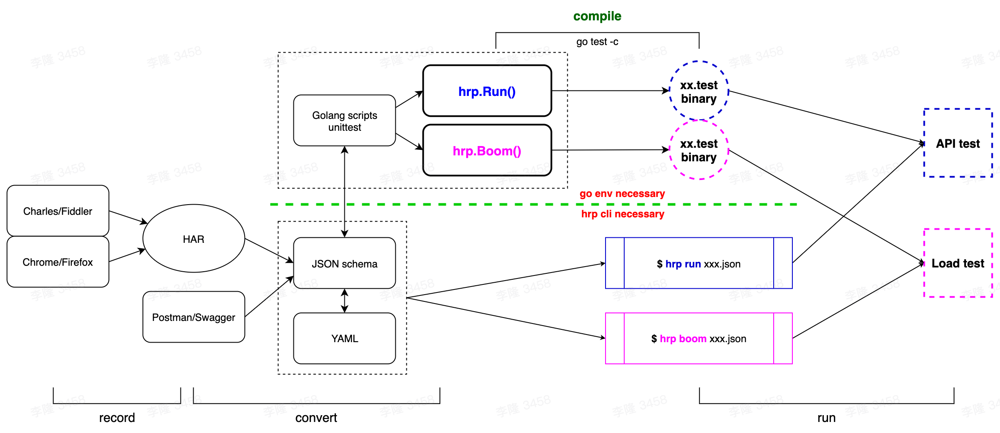

# hrp (HttpRunner+)

[](https://pkg.go.dev/github.com/httprunner/hrp)
[](https://github.com/httprunner/hrp/actions)
[](https://codecov.io/gh/httprunner/hrp)
[](https://goreportcard.com/report/github.com/httprunner/hrp)
[](https://app.fossa.com/reports/c2742455-c8ab-4b13-8fd7-4a35ba0b2840)

`hrp` aims to be a one-stop solution for HTTP(S) testing, covering API testing, load testing and digital experience monitoring (DEM).

## Key Features



- [x] Full support for HTTP(S) requests, more protocols are also in the plan.
- [x] Testcases can be described in multiple formats, `YAML`/`JSON`/`Golang`, and they are interchangeable.
- [x] With [`HAR`][HAR] support, you can use Charles/Fiddler/Chrome/etc as a script recording generator.
- [x] Supports `variables`/`extract`/`validate`/`hooks` mechanisms to create extremely complex test scenarios.
- [x] Built-in integration of rich functions, and you can also use [hashicorp/plugin] or [go plugin] to create and call custom functions.
- [x] Inherit all powerful features of [`Boomer`][Boomer] and [`locust`][locust], you can run `load test` without extra work.
- [x] Using it as a `CLI tool` or a `library` are both supported.

See [CHANGELOG].

## Quick Start

### use as CLI tool

You can install `hrp` with one shell command, which will download the latest version's released binary and install to the current system.

```bash
# install via curl
$ bash -c "$(curl -ksSL https://raw.githubusercontent.com/httprunner/hrp/main/cli/scripts/install.sh)"
# install via wget
$ bash -c "$(wget https://raw.githubusercontent.com/httprunner/hrp/main/cli/scripts/install.sh -O -)"
```

If you are a golang developer, you can also install `hrp` with `go get`.

```bash
$ go get -u github.com/httprunner/hrp/cli/hrp
```

Since installed, you will get a `hrp` command with multiple sub-commands.

```text
$ hrp -h

██╗  ██╗████████╗████████╗██████╗ ██████╗ ██╗   ██╗███╗   ██╗███╗   ██╗███████╗██████╗
██║  ██║╚══██╔══╝╚══██╔══╝██╔══██╗██╔══██╗██║   ██║████╗  ██║████╗  ██║██╔════╝██╔══██╗
███████║   ██║      ██║   ██████╔╝██████╔╝██║   ██║██╔██╗ ██║██╔██╗ ██║█████╗  ██████╔╝
██╔══██║   ██║      ██║   ██╔═══╝ ██╔══██╗██║   ██║██║╚██╗██║██║╚██╗██║██╔══╝  ██╔══██╗
██║  ██║   ██║      ██║   ██║     ██║  ██║╚██████╔╝██║ ╚████║██║ ╚████║███████╗██║  ██║
╚═╝  ╚═╝   ╚═╝      ╚═╝   ╚═╝     ╚═╝  ╚═╝ ╚═════╝ ╚═╝  ╚═══╝╚═╝  ╚═══╝╚══════╝╚═╝  ╚═╝

hrp (HttpRunner+) aims to be a one-stop solution for HTTP(S) testing, covering API testing,
load testing and digital experience monitoring (DEM). Enjoy! ✨ 🚀 ✨

License: Apache-2.0
Website: https://httprunner.com
Github: https://github.com/httprunner/hrp
Copyright 2021 debugtalk

Usage:
  hrp [command]

Available Commands:
  boom         run load test with boomer
  completion   generate the autocompletion script for the specified shell
  har2case     convert HAR to json/yaml testcase files
  help         Help about any command
  run          run API test
  startproject create a scaffold project

Flags:
  -h, --help               help for hrp
      --log-json           set log to json format
  -l, --log-level string   set log level (default "INFO")
  -v, --version            version for hrp

Use "hrp [command] --help" for more information about a command.
```

You can use `hrp run` command to run HttpRunner JSON/YAML testcases. The following is an example running [examples/demo.json][demo.json]

<details>
<summary>$ hrp run examples/demo.json</summary>

```text
5:21PM INF Set log to color console other than JSON format.
5:21PM ??? Set log level
5:21PM INF [init] SetDebug debug=true
5:21PM INF [init] SetFailfast failfast=true
5:21PM INF [init] Reset session variables
5:21PM INF load json testcase path=/Users/debugtalk/MyProjects/HttpRunner-dev/hrp/examples/demo.json
5:21PM INF call function success arguments=[5] funcName=gen_random_string output=A65rg
5:21PM INF call function success arguments=[12.3,3.45] funcName=max output=12.3
5:21PM INF run testcase start testcase="demo with complex mechanisms"
5:21PM INF transaction name=tran1 type=start
5:21PM INF run step start step="get with params"
5:21PM INF call function success arguments=[12.3,34.5] funcName=max output=34.5
-------------------- request --------------------
GET /get?foo1=A65rg&foo2=34.5 HTTP/1.1
Host: postman-echo.com
User-Agent: HttpRunnerPlus


==================== response ===================
HTTP/1.1 200 OK
Content-Length: 304
Connection: keep-alive
Content-Type: application/json; charset=utf-8
Date: Thu, 23 Dec 2021 09:21:30 GMT
Etag: W/"130-t7qE4M7C+OQ0jGdRWkr2R3gjq+w"
Set-Cookie: sails.sid=s%3AAiqfRgMtWKG3oOQnXJOxRD8xk58rtAW6.eD%2BBo7FBnA82XLsLFiadeg6OcuD2zHSTyhv2l%2FDVuCk; Path=/; HttpOnly
Vary: Accept-Encoding

{"args":{"foo1":"A65rg","foo2":"34.5"},"headers":{"x-forwarded-proto":"https","x-forwarded-port":"443","host":"postman-echo.com","x-amzn-trace-id":"Root=1-61c43f9a-7c855775053963a4284ba464","user-agent":"HttpRunnerPlus","accept-encoding":"gzip"},"url":"https://postman-echo.com/get?foo1=A65rg&foo2=34.5"}
--------------------------------------------------
5:21PM INF extract value from=body.args.foo1 value=A65rg
5:21PM INF set variable value=A65rg variable=varFoo1
5:21PM INF validate status_code assertMethod=equals checkValue=200 expectValue=200 result=true
5:21PM INF validate headers."Content-Type" assertMethod=startswith checkValue="application/json; charset=utf-8" expectValue=application/json result=true
5:21PM INF validate body.args.foo1 assertMethod=length_equals checkValue=A65rg expectValue=5 result=true
5:21PM INF validate $varFoo1 assertMethod=length_equals checkValue=A65rg expectValue=5 result=true
5:21PM INF validate body.args.foo2 assertMethod=equals checkValue=34.5 expectValue=34.5 result=true
5:21PM INF run step end exportVars={"varFoo1":"A65rg"} step="get with params" success=true
5:21PM INF transaction name=tran1 type=end
5:21PM INF transaction elapsed=1021.174113 name=tran1
5:21PM INF run step start step="post json data"
5:21PM INF call function success arguments=[12.3,3.45] funcName=max output=12.3
-------------------- request --------------------
POST /post HTTP/1.1
Host: postman-echo.com
Content-Type: application/json; charset=UTF-8

{"foo1":"A65rg","foo2":12.3}
==================== response ===================
HTTP/1.1 200 OK
Content-Length: 424
Connection: keep-alive
Content-Type: application/json; charset=utf-8
Date: Thu, 23 Dec 2021 09:21:30 GMT
Etag: W/"1a8-IhWXQxTXlxmnbqdRh+oBPRTLsOU"
Set-Cookie: sails.sid=s%3AzXIPVMKipoISZG0Zj4tX73vKDbIdFtzZ.xD50I4UMHUERmcgWfp64f0a8g%2BT9YIUf0Fi1l5bXbQA; Path=/; HttpOnly
Vary: Accept-Encoding

{"args":{},"data":{"foo1":"A65rg","foo2":12.3},"files":{},"form":{},"headers":{"x-forwarded-proto":"https","x-forwarded-port":"443","host":"postman-echo.com","x-amzn-trace-id":"Root=1-61c43f9a-78aab84a36a753ea6b5dd0f7","content-length":"28","user-agent":"Go-http-client/1.1","content-type":"application/json; charset=UTF-8","accept-encoding":"gzip"},"json":{"foo1":"A65rg","foo2":12.3},"url":"https://postman-echo.com/post"}
--------------------------------------------------
5:21PM INF validate status_code assertMethod=equals checkValue=200 expectValue=200 result=true
5:21PM INF validate body.json.foo1 assertMethod=length_equals checkValue=A65rg expectValue=5 result=true
5:21PM INF validate body.json.foo2 assertMethod=equals checkValue=12.3 expectValue=12.3 result=true
5:21PM INF run step end exportVars=null step="post json data" success=true
5:21PM INF run step start step="post form data"
5:21PM INF call function success arguments=[12.3,3.45] funcName=max output=12.3
-------------------- request --------------------
POST /post HTTP/1.1
Host: postman-echo.com
Content-Type: application/x-www-form-urlencoded; charset=UTF-8

foo1=A65rg&foo2=12.3
==================== response ===================
HTTP/1.1 200 OK
Content-Length: 445
Connection: keep-alive
Content-Type: application/json; charset=utf-8
Date: Thu, 23 Dec 2021 09:21:30 GMT
Etag: W/"1bd-g4G7WmMU7EzJYzPTYgqX67Ug9iE"
Set-Cookie: sails.sid=s%3Al3gcdxEQug7ddxPlA2Kfxvm7d_z9ImEt.4IQI1SVX5xuTefX0N0UvJPQxVvA1SAMm7ztHESkHXsY; Path=/; HttpOnly
Vary: Accept-Encoding

{"args":{},"data":"","files":{},"form":{"foo1":"A65rg","foo2":"12.3"},"headers":{"x-forwarded-proto":"https","x-forwarded-port":"443","host":"postman-echo.com","x-amzn-trace-id":"Root=1-61c43f9a-6458626c64b04fd60245714b","content-length":"20","user-agent":"Go-http-client/1.1","content-type":"application/x-www-form-urlencoded; charset=UTF-8","accept-encoding":"gzip"},"json":{"foo1":"A65rg","foo2":"12.3"},"url":"https://postman-echo.com/post"}
--------------------------------------------------
5:21PM INF validate status_code assertMethod=equals checkValue=200 expectValue=200 result=true
5:21PM INF validate body.form.foo1 assertMethod=length_equals checkValue=A65rg expectValue=5 result=true
5:21PM INF validate body.form.foo2 assertMethod=equals checkValue=12.3 expectValue=12.3 result=true
5:21PM INF run step end exportVars=null step="post form data" success=true
5:21PM INF run testcase end testcase="demo with complex mechanisms"
```
</details>

### use as library

Beside using `hrp` as a CLI tool, you can also use it as golang library.

```bash
$ go get -u github.com/httprunner/hrp
```

This is an example of `HttpRunner+` testcase. You can find more in the [`examples`][examples] directory.


<details>
<summary>demo</summary>

```go
import (
    "testing"

    "github.com/httprunner/hrp"
)

func TestCaseDemo(t *testing.T) {
    demoTestCase := &hrp.TestCase{
        Config: hrp.NewConfig("demo with complex mechanisms").
            SetBaseURL("https://postman-echo.com").
            WithVariables(map[string]interface{}{ // global level variables
                "n":       5,
                "a":       12.3,
                "b":       3.45,
                "varFoo1": "${gen_random_string($n)}",
                "varFoo2": "${max($a, $b)}", // 12.3; eval with built-in function
            }),
        TestSteps: []hrp.IStep{
            hrp.NewStep("transaction 1 start").StartTransaction("tran1"), // start transaction
            hrp.NewStep("get with params").
                WithVariables(map[string]interface{}{ // step level variables
                    "n":       3,                // inherit config level variables if not set in step level, a/varFoo1
                    "b":       34.5,             // override config level variable if existed, n/b/varFoo2
                    "varFoo2": "${max($a, $b)}", // 34.5; override variable b and eval again
                }).
                GET("/get").
                WithParams(map[string]interface{}{"foo1": "$varFoo1", "foo2": "$varFoo2"}). // request with params
                WithHeaders(map[string]string{"User-Agent": "HttpRunnerPlus"}).             // request with headers
                Extract().
                WithJmesPath("body.args.foo1", "varFoo1"). // extract variable with jmespath
                Validate().
                AssertEqual("status_code", 200, "check response status code").        // validate response status code
                AssertStartsWith("headers.\"Content-Type\"", "application/json", ""). // validate response header
                AssertLengthEqual("body.args.foo1", 5, "check args foo1").            // validate response body with jmespath
                AssertLengthEqual("$varFoo1", 5, "check args foo1").                  // assert with extracted variable from current step
                AssertEqual("body.args.foo2", "34.5", "check args foo2"),             // notice: request params value will be converted to string
            hrp.NewStep("transaction 1 end").EndTransaction("tran1"), // end transaction
            hrp.NewStep("post json data").
                POST("/post").
                WithBody(map[string]interface{}{
                    "foo1": "$varFoo1",       // reference former extracted variable
                    "foo2": "${max($a, $b)}", // 12.3; step level variables are independent, variable b is 3.45 here
                }).
                Validate().
                AssertEqual("status_code", 200, "check status code").
                AssertLengthEqual("body.json.foo1", 5, "check args foo1").
                AssertEqual("body.json.foo2", 12.3, "check args foo2"),
            hrp.NewStep("post form data").
                POST("/post").
                WithHeaders(map[string]string{"Content-Type": "application/x-www-form-urlencoded; charset=UTF-8"}).
                WithBody(map[string]interface{}{
                    "foo1": "$varFoo1",       // reference former extracted variable
                    "foo2": "${max($a, $b)}", // 12.3; step level variables are independent, variable b is 3.45 here
                }).
                Validate().
                AssertEqual("status_code", 200, "check status code").
                AssertLengthEqual("body.form.foo1", 5, "check args foo1").
                AssertEqual("body.form.foo2", "12.3", "check args foo2"), // form data will be converted to string
        },
    }

    err := hrp.NewRunner(nil).Run(demoTestCase) // hrp.Run(demoTestCase)
    if err != nil {
        t.Fatalf("run testcase error: %v", err)
    }
}
```
</details>

## Subscribe

关注 HttpRunner 的微信公众号，第一时间获得最新资讯。


[HttpRunner]: https://github.com/httprunner/httprunner
[Boomer]: https://github.com/myzhan/boomer
[locust]: https://github.com/locustio/locust
[jmespath]: https://jmespath.org/
[allure]: https://docs.qameta.io/allure/
[HAR]: http://httparchive.org/
[hashicorp/plugin]: https://github.com/hashicorp/go-plugin
[go plugin]: https://pkg.go.dev/plugin
[demo.json]: https://github.com/httprunner/hrp/blob/main/examples/demo.json
[examples]: https://github.com/httprunner/hrp/blob/main/examples/
[CHANGELOG]: docs/CHANGELOG.md