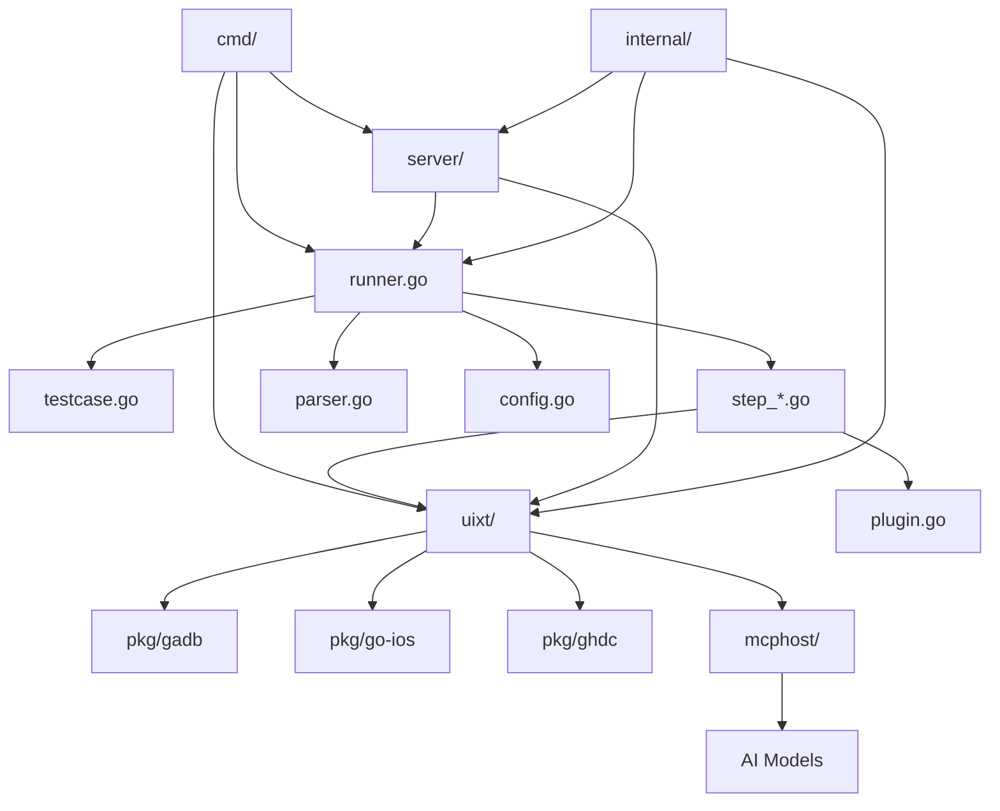

# HttpRunner v5 项目模块功能及依赖关系分析

## 项目概述

HttpRunner v5 是一个开源的通用测试框架，采用 Go 语言编写，支持 API 接口测试、性能测试和 UI 自动化测试。项目融入了大模型技术，支持 Android/iOS/Harmony/Browser 多种系统平台的 UI 自动化测试。

## 核心架构

### 1. 主要模块结构

```
httprunner/
├── cmd/                    # 命令行工具入口
├── internal/               # 内部模块
├── pkg/                    # 公共包
├── uixt/                   # UI 测试扩展模块
├── server/                 # HTTP 服务器模块
├── mcphost/                # MCP (Model Context Protocol) 主机模块
├── examples/               # 示例代码
├── tests/                  # 测试用例
└── docs/                   # 文档
```

## 详细模块分析

### 1. 命令行模块 (cmd/)

**功能**: 提供 `hrp` 命令行工具的各种子命令

**主要文件**:
- `root.go` - 根命令定义和全局配置
- `run.go` - 执行测试用例命令
- `server.go` - 启动 HTTP 服务器命令
- `convert.go` - 格式转换命令
- `build.go` - 插件构建命令
- `pytest.go` - Python pytest 集成命令
- `mcphost.go` - MCP 主机命令
- `scaffold.go` - 脚手架项目创建命令
- `wiki.go` - 文档访问命令
- `adb/` - Android 设备管理工具
- `ios/` - iOS 设备管理工具

**依赖关系**:
- 依赖 `github.com/spf13/cobra` 构建命令行界面
- 调用各个核心模块的功能

### 2. 核心运行器模块

**主要文件**:
- `runner.go` - 核心测试运行器，包含 HRPRunner、CaseRunner、SessionRunner
- `testcase.go` - 测试用例定义和加载
- `step.go` - 测试步骤接口定义
- `step_*.go` - 各种类型的测试步骤实现

**功能**:
- **HRPRunner**: 全局运行器，管理 HTTP 客户端、配置等
- **CaseRunner**: 单个测试用例运行器，处理参数化和解析
- **SessionRunner**: 会话运行器，执行具体的测试步骤

**支持的步骤类型**:
- `step_request.go` - HTTP 请求步骤
- `step_api.go` - API 调用步骤
- `step_testcase.go` - 嵌套测试用例步骤
- `step_websocket.go` - WebSocket 通信步骤
- `step_ui.go` - UI 自动化步骤
- `step_transaction.go` - 事务步骤
- `step_rendezvous.go` - 集合点步骤
- `step_thinktime.go` - 思考时间步骤
- `step_shell.go` - Shell 命令步骤
- `step_function.go` - 自定义函数步骤

### 3. 内部模块 (internal/)

**功能**: 提供内部工具和辅助功能

**主要子模块**:
- `builtin/` - 内置函数和工具
- `config/` - 配置管理
- `json/` - JSON 处理工具
- `sdk/` - SDK 相关功能
- `version/` - 版本信息
- `wiki/` - 文档相关
- `scaffold/` - 脚手架模板
- `httpstat/` - HTTP 统计
- `utf7/` - UTF-7 编码处理

### 4. UI 测试扩展模块 (uixt/)

**功能**: 提供跨平台 UI 自动化测试能力

**核心文件**:
- `driver.go` - 驱动器接口定义
- `device.go` - 设备抽象接口
- `android_*.go` - Android 平台实现
- `ios_*.go` - iOS 平台实现
- `harmony_*.go` - Harmony 平台实现
- `browser_*.go` - 浏览器平台实现
- `mcp_server.go` - MCP 服务器实现
- `cache.go` - 缓存管理

**平台支持**:
- **Android**: 基于 ADB 和 UIAutomator2
- **iOS**: 基于 WebDriverAgent (WDA)
- **Harmony**: 基于 HDC (Harmony Device Connector)
- **Browser**: 基于 WebDriver 协议

**AI 集成**:
- `driver_ext_ai.go` - AI 功能扩展
- `ai/` - AI 相关模块

### 5. 公共包模块 (pkg/)

**功能**: 提供可复用的公共组件

**主要子模块**:
- `gadb/` - Android ADB 工具包装
- `go-ios/` - iOS 设备管理工具
- `ghdc/` - Harmony HDC 工具包装

### 6. HTTP 服务器模块 (server/)

**功能**: 提供 Web 界面和 API 服务

**主要文件**:
- `main.go` - 服务器主入口
- `app.go` - 应用路由和中间件
- `ui.go` - Web UI 处理
- `device.go` - 设备管理 API
- `uixt.go` - UI 测试 API
- `context.go` - 上下文管理
- `model.go` - 数据模型

### 7. MCP 主机模块 (mcphost/)

**功能**: 实现 Model Context Protocol 主机功能，支持大模型集成

**特点**:
- 独立的 Git 仓库子模块
- 提供与大模型的通信接口
- 支持自然语言驱动的测试场景

### 8. 配置和解析模块

**主要文件**:
- `config.go` - 全局配置管理
- `parser.go` - 表达式解析器
- `parameters.go` - 参数化处理
- `loader.go` - 文件加载器

**功能**:
- 支持 YAML/JSON 格式的测试用例
- 变量替换和表达式计算
- 参数化测试支持

### 9. 插件系统

**主要文件**:
- `plugin.go` - 插件管理
- `build.go` - 插件构建

**功能**:
- 支持 Go 插件和 HashiCorp 插件
- 自定义函数扩展
- 动态加载插件

## 依赖关系图



## 核心依赖库

### 外部依赖
- **Web 框架**: `github.com/gin-gonic/gin`
- **命令行**: `github.com/spf13/cobra`
- **日志**: `github.com/rs/zerolog`
- **WebSocket**: `github.com/gorilla/websocket`
- **JSON 处理**: `github.com/bytedance/sonic`
- **YAML 处理**: `gopkg.in/yaml.v3`
- **插件系统**: `github.com/hashicorp/go-plugin`
- **设备管理**: `github.com/danielpaulus/go-ios`
- **AI 集成**: `github.com/cloudwego/eino`
- **MCP 协议**: `github.com/mark3labs/mcp-go`

### 内部依赖
- **函数插件**: `github.com/httprunner/funplugin`

## 数据流

1. **测试执行流程**:
   ```
   hrp run → HRPRunner → CaseRunner → SessionRunner → Step执行
   ```

2. **UI 测试流程**:
   ```
   UI Step → uixt.Driver → 平台特定驱动 → 设备操作
   ```

3. **配置解析流程**:
   ```
   配置文件 → Loader → Parser → 变量替换 → 执行上下文
   ```

## 扩展性设计

### 1. 插件系统
- 支持 Go 原生插件和 HashiCorp 插件
- 可扩展自定义函数和验证器
- 动态加载和热更新

### 2. 平台扩展
- 统一的 Driver 接口
- 平台特定的实现
- 易于添加新平台支持

### 3. 步骤类型扩展
- IStep 接口设计
- 可插拔的步骤类型
- 支持自定义步骤实现

## 总结

HttpRunner v5 采用模块化设计，具有以下特点：

1. **高度模块化**: 清晰的模块边界和职责分离
2. **跨平台支持**: 统一 API 支持多种平台
3. **可扩展性**: 插件系统和接口设计支持功能扩展
4. **AI 集成**: 通过 MCP 协议集成大模型能力
5. **丰富的测试类型**: 支持 API、UI、性能等多种测试
6. **现代化技术栈**: 使用 Go 语言和现代化的依赖库

该架构设计使得 HttpRunner 既能满足当前的测试需求，又具备良好的扩展性和维护性。