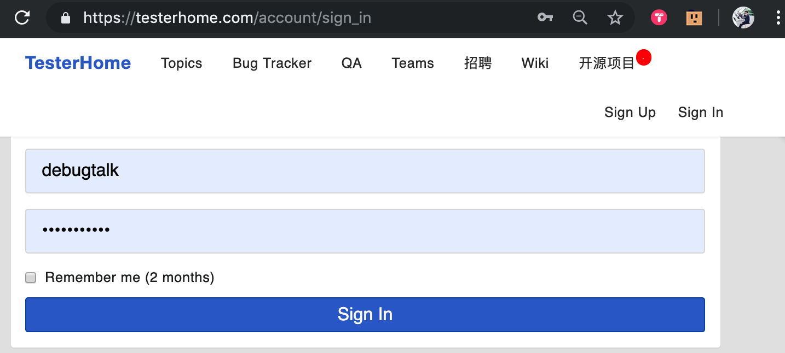
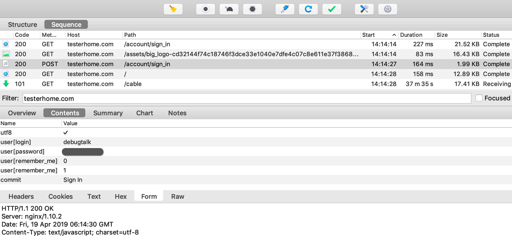
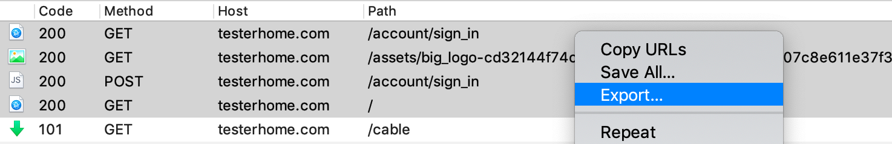
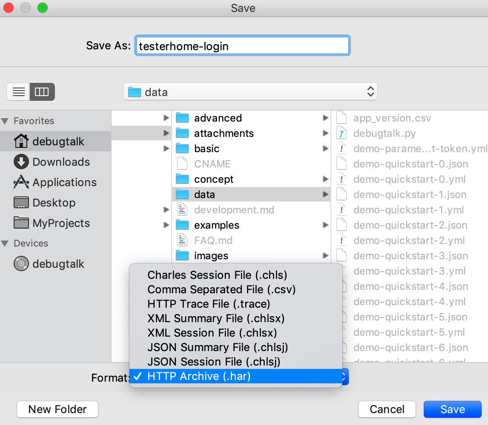
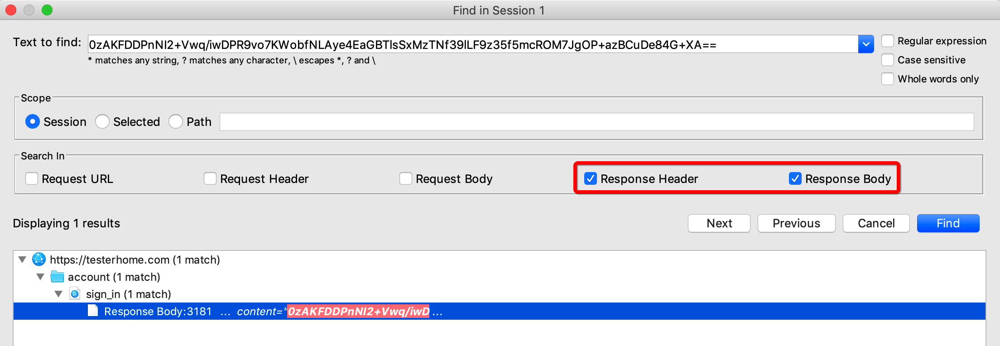
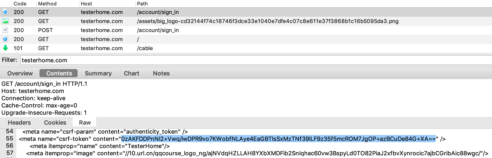

## 案例介绍

通过接口自动化实现 TesterHome 的登录退出功能。



功能描述：

- 进入[登录页面](https://testerhome.com/account/sign_in)
- 输入账号和密码
- 点击【Sign In】进行登录

## 准备工作

### 抓包生成 HAR 文件

在浏览器中人工进行登录操作，同时使用抓包工具进行抓包。抓包时建议使用过滤器（Filter），常用的做法是采用被测系统的 host，将无关请求过滤掉。



选择需要生成测试用例的请求，导出为 HTTP Archive (.har) 格式的文件。





### 转换生成测试用例

成功安装 HttpRunner 后，系统中会新增 `har2case` 命令，使用该命令可将 HAR 数据包转换为 HttpRunner 支持的 `YAML/JSON` 测试用例文件。

```bash
$ har2case docs/data/testerhome-login.har -2y
INFO:root:Start to generate testcase.
INFO:root:dump testcase to YAML format.
INFO:root:Generate YAML testcase successfully: docs/data/testerhome-login.yml
```

生成的测试用例内容如下：

<details>
<summary>点击查看</summary>

```yaml
- config:
    name: testcase description
    variables: {}

- test:
    name: /account/sign_in
    request:
        headers:
            If-None-Match: W/"bc9ae267fdcbd89bf1dfaea10dea2b0e"
            User-Agent: Mozilla/5.0 (Macintosh; Intel Mac OS X 10_14_3) AppleWebKit/537.36
                (KHTML, like Gecko) Chrome/73.0.3683.103 Safari/537.36
        method: GET
        url: https://testerhome.com/account/sign_in
    validate:
        - eq: [status_code, 200]
        - eq: [headers.Content-Type, text/html; charset=utf-8]

- test:
    name: /assets/big_logo-cd32144f74c18746f3dce33e1040e7dfe4c07c8e611e37f3868b1c16b5095da3.png
    request:
        headers:
            User-Agent: Mozilla/5.0 (Macintosh; Intel Mac OS X 10_14_3) AppleWebKit/537.36
                (KHTML, like Gecko) Chrome/73.0.3683.103 Safari/537.36
        method: GET
        url: https://testerhome.com/assets/big_logo-cd32144f74c18746f3dce33e1040e7dfe4c07c8e611e37f3868b1c16b5095da3.png
    validate:
        - eq: [status_code, 200]
        - eq: [headers.Content-Type, image/png]

- test:
    name: /account/sign_in
    request:
        data:
            commit: Sign In
            user[login]: debugtalk
            user[password]: XXXXXXXX
            user[remember_me]: '1'
            utf8: ✓
        headers:
            Content-Type: application/x-www-form-urlencoded; charset=UTF-8
            User-Agent: Mozilla/5.0 (Macintosh; Intel Mac OS X 10_14_3) AppleWebKit/537.36
                (KHTML, like Gecko) Chrome/73.0.3683.103 Safari/537.36
            X-CSRF-Token: 0zAKFDDPnNI2+Vwq/iwDPR9vo7KWobfNLAye4EaGBTlsSxMzTNf39lLF9z35f5mcROM7JgOP+azBCuDe84G+XA==
            X-Requested-With: XMLHttpRequest
        method: POST
        url: https://testerhome.com/account/sign_in
    validate:
        - eq: [status_code, 200]
        - eq: [headers.Content-Type, text/javascript; charset=utf-8]

- test:
    name: /
    request:
        headers:
            If-None-Match: W/"bad62c68dac27b01151516aad5c7f0be"
            Turbolinks-Referrer: https://testerhome.com/account/sign_in
            User-Agent: Mozilla/5.0 (Macintosh; Intel Mac OS X 10_14_3) AppleWebKit/537.36
                (KHTML, like Gecko) Chrome/73.0.3683.103 Safari/537.36
        method: GET
        url: https://testerhome.com/
    validate:
        - eq: [status_code, 200]
        - eq: [headers.Content-Type, text/html; charset=utf-8]
```
</details>

### 首次运行测试用例

成功安装 HttpRunner 后，系统中会新增 `hrun` 命令，该命令是 HttpRunner 的核心命令，用于运行 HttpRunner 支持的 `YAML/JSON` 测试用例文件。

生成测试用例后，我们可以先尝试运行一次，大多数情况，如果被测场景中不存在关联的情况，是可以直接运行成功的。

```bash
$ hrun docs/data/testerhome-login.yml --failfast --log-level info
INFO     Start to run testcase: testcase description
/account/sign_in
INFO     GET https://testerhome.com/account/sign_in
INFO     status_code: 200, response_time(ms): 189.66 ms, response_length: 12584 bytes

.
/assets/big_logo-cd32144f74c18746f3dce33e1040e7dfe4c07c8e611e37f3868b1c16b5095da3.png
INFO     GET https://testerhome.com/assets/big_logo-cd32144f74c18746f3dce33e1040e7dfe4c07c8e611e37f3868b1c16b5095da3.png
INFO     status_code: 200, response_time(ms): 83.98 ms, response_length: 15229 bytes

.
/account/sign_in
INFO     POST https://testerhome.com/account/sign_in
INFO     status_code: 200, response_time(ms): 172.8 ms, response_length: 89 bytes

.
/
INFO     GET https://testerhome.com/
INFO     status_code: 200, response_time(ms): 257.41 ms, response_length: 52463 bytes

.

----------------------------------------------------------------------
Ran 4 tests in 0.722s

OK
INFO     Start to render Html report ...
INFO     Generated Html report: /Users/debugtalk/MyProjects/HttpRunner-dev/httprunner-docs-v2x/reports/1555662601.html
```

比较幸运，脚本在没有做任何修改的情况下运行成功了。


## 调试 & 优化测试用例

虽然脚本运行成功了，但是为了更好地管理和维护脚本，需要对脚本进行优化调整。

### 关联处理

查看录制生成的脚本，可以看到在发起登录请求时包含了 `X-CSRF-Token`，如果熟悉网络信息安全的基础知识，就会联想到该字段是动态变化的，每次都是先从服务器端返回至客户端，客户端在后续发起请求时需要携带该字段。

```yaml
- test:
    name: /account/sign_in
    request:
        data:
            commit: Sign In
            user[login]: debugtalk
            user[password]: XXXXXXXX
            user[remember_me]: '1'
            utf8: ✓
        headers:
            Content-Type: application/x-www-form-urlencoded; charset=UTF-8
            User-Agent: Mozilla/5.0 (Macintosh; Intel Mac OS X 10_14_3) AppleWebKit/537.36
                (KHTML, like Gecko) Chrome/73.0.3683.103 Safari/537.36
            X-CSRF-Token: 0zAKFDDPnNI2+Vwq/iwDPR9vo7KWobfNLAye4EaGBTlsSxMzTNf39lLF9z35f5mcROM7JgOP+azBCuDe84G+XA==
            X-Requested-With: XMLHttpRequest
        method: POST
        url: https://testerhome.com/account/sign_in
    validate:
        - eq: [status_code, 200]
        - eq: [headers.Content-Type, text/html; charset=utf-8]
```

虽然当前直接运行录制生成的脚本也是成功的，但很有可能在过了一段时间后，`X-CSRF-Token` 失效，脚本也就无法再成功运行了。因此在测试脚本中，该字段不能写死为抓包时获取的值，而是要每次动态地从前面的接口响应中获取。

那要怎么确定该字段是在之前的哪个接口中返回的呢？

操作方式也很简单，可以在抓包工具中对该字段进行搜索，特别地，搜索范围限定为响应内容（Response Header、Response Body）。

即可搜索得到该字段是在哪个接口中从服务器端返回值客户端的。



有时候可能搜索会得到多个结果，那么在确定是使用哪个接口响应的时候，遵循两个原则即可：

- 响应一定是出现在当前接口之前
- 如果在当前接口之前存在多个接口均有此返回，那么取最靠近当前接口的即可

通过前面的搜索可知，`X-CSRF-Token` 的值是在第一个接口中响应返回的。



确定出具体的接口后，那么就可以在测试脚本中从该接口使用 `extract` 提取对应的字段，然后在后续接口中引用提取出的字段。

在当前案例中，第一个接口的响应内容为 HTML 页面，要提取字段可以使用正则匹配的方式。具体的做法就是指定目标字段的左右边界，目标字段使用 `(.*)` 匹配获取。

```yaml
- test:
    name: /account/sign_in
    request:
        headers:
            If-None-Match: W/"bc9ae267fdcbd89bf1dfaea10dea2b0e"
            User-Agent: Mozilla/5.0 (Macintosh; Intel Mac OS X 10_14_3) AppleWebKit/537.36
                (KHTML, like Gecko) Chrome/73.0.3683.103 Safari/537.36
        method: GET
        url: https://testerhome.com/account/sign_in
    extract:
        X_CSRF_Token: <meta name="csrf-token" content="(.*)" />
    validate:
        - eq: [status_code, 200]
        - eq: [headers.Content-Type, text/html; charset=utf-8]
```

然后，在后续使用到该字段的接口中，引用提取出的字段即可。

```yaml
- test:
    name: /account/sign_in
    request:
        data:
            commit: Sign In
            user[login]: debugtalk
            user[password]: XXXXXXXX
            user[remember_me]: '1'
            utf8: ✓
        headers:
            Content-Type: application/x-www-form-urlencoded; charset=UTF-8
            User-Agent: Mozilla/5.0 (Macintosh; Intel Mac OS X 10_14_3) AppleWebKit/537.36
                (KHTML, like Gecko) Chrome/73.0.3683.103 Safari/537.36
            X-CSRF-Token: $X_CSRF_Token
            X-Requested-With: XMLHttpRequest
        method: POST
        url: https://testerhome.com/account/sign_in
    validate:
        - eq: [status_code, 200]
        - eq: [headers.Content-Type, text/html; charset=utf-8]
```
