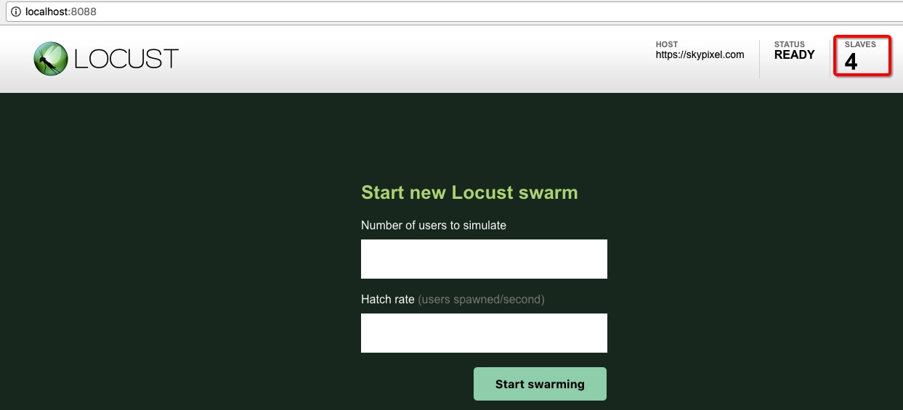

## Load Test

With reuse of [`Locust`][Locust], you can run performance test without extra work.

```bash
$ locusts -V
[2017-08-26 23:45:42,246] bogon/INFO/stdout: Locust 0.8a2
[2017-08-26 23:45:42,246] bogon/INFO/stdout:
```

For full usage, you can run `locusts -h` to see help, and you will find that it is the same with `locust -h`.

The only difference is the `-f` argument. If you specify `-f` with a Python locustfile, it will be the same as `locust`, while if you specify `-f` with a `YAML/JSON` testcase file, it will convert to Python locustfile first and then pass to `locust`.

```bash
$ locusts -f examples/first-testcase.yml
[2017-08-18 17:20:43,915] Leos-MacBook-Air.local/INFO/locust.main: Starting web monitor at *:8089
[2017-08-18 17:20:43,918] Leos-MacBook-Air.local/INFO/locust.main: Starting Locust 0.8a2
```

In this case, you can reuse all features of [`Locust`][Locust].

That’s not all about it. With the argument `--cpu-cores`, you can even start locust with master and specified number of slaves (default to cpu cores number) at one time, which means you can leverage all cpus of your machine.

```bash
$ locusts -f examples/first-testcase.yml --cpu-cores 4
[2017-08-26 23:51:47,071] bogon/INFO/locust.main: Starting web monitor at *:8089
[2017-08-26 23:51:47,075] bogon/INFO/locust.main: Starting Locust 0.8a2
[2017-08-26 23:51:47,078] bogon/INFO/locust.main: Starting Locust 0.8a2
[2017-08-26 23:51:47,080] bogon/INFO/locust.main: Starting Locust 0.8a2
[2017-08-26 23:51:47,083] bogon/INFO/locust.main: Starting Locust 0.8a2
[2017-08-26 23:51:47,084] bogon/INFO/locust.runners: Client 'bogon_656e0af8e968a8533d379dd252422ad3' reported as ready. Currently 1 clients ready to swarm.
[2017-08-26 23:51:47,085] bogon/INFO/locust.runners: Client 'bogon_09f73850252ee4ec739ed77d3c4c6dba' reported as ready. Currently 2 clients ready to swarm.
[2017-08-26 23:51:47,084] bogon/INFO/locust.main: Starting Locust 0.8a2
[2017-08-26 23:51:47,085] bogon/INFO/locust.runners: Client 'bogon_869f7ed671b1a9952b56610f01e2006f' reported as ready. Currently 3 clients ready to swarm.
[2017-08-26 23:51:47,085] bogon/INFO/locust.runners: Client 'bogon_80a804cda36b80fac17b57fd2d5e7cdb' reported as ready. Currently 4 clients ready to swarm.
```



Enjoy!


[Locust]: http://locust.io/