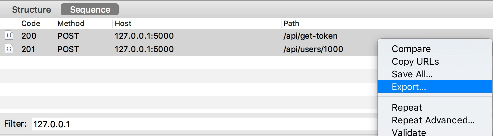
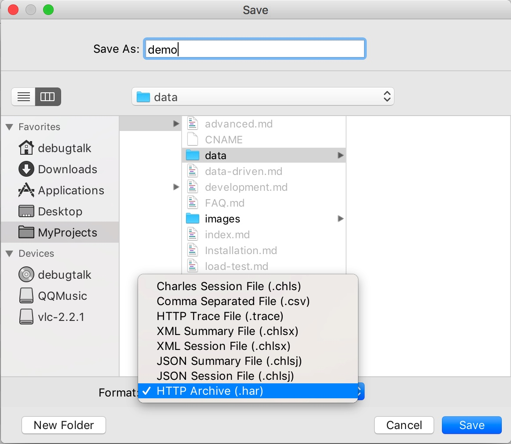

为了简化测试用例的编写工作，HttpRunner 实现了测试用例生成的功能，对应的转换工具为一个独立的项目：[har2case][har2case]。

简单来说，就是当前主流的抓包工具和浏览器都支持将抓取得到的数据包导出为标准通用的 HAR 格式（HTTP Archive），然后 HttpRunner 实现了将 HAR 格式的数据包转换为`YAML/JSON`格式的测试用例文件的功能。

## 获取 HAR 数据包

在转换生成测试用例之前，需要先将抓取得到的数据包导出为 HAR 格式的文件。在`Charles Proxy`中的操作方式为，选中需要转换的接口（可多选或全选），点击右键，在悬浮的菜单目录中点击【Export...】，格式选择`HTTP Archive(.har)`后保存即可；假设我们保存的文件名称为 demo.har。





## 转换生成测试用例

然后，在命令行终端中运行 har2case 命令，即可将 demo.har 转换为 HttpRunner 的测试用例文件。

使用 `har2case` 转换脚本时默认转换为 JSON 格式。

```bash
$ har2case docs/data/demo-quickstart.har
INFO:root:Start to generate testcase.
INFO:root:dump testcase to JSON format.
INFO:root:Generate JSON testcase successfully: docs/data/demo-quickstart.json
```

加上 `-2y`/`--to-yml` 参数后转换为 YAML 格式。

```bash
$ har2case docs/data/demo-quickstart.har -2y
INFO:root:Start to generate testcase.
INFO:root:dump testcase to YAML format.
INFO:root:Generate YAML testcase successfully: docs/data/demo-quickstart.yml
```

两种格式完全等价，YAML 格式更简洁，JSON 格式支持的工具更丰富，大家可根据个人喜好进行选择。

[har2case]: https://github.com/HttpRunner/har2case