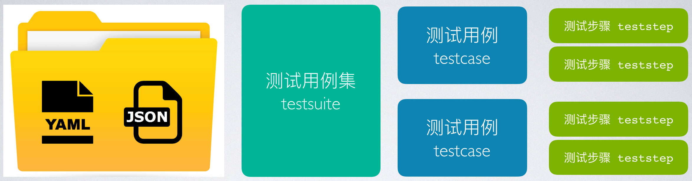

## YAML & JSON

HttpRunner 的测试用例支持两种文件格式：YAML 和 JSON。

JSON 和 YAML 格式的测试用例完全等价，包含的信息内容也完全相同。

- 对于新手来说，推荐使用 JSON 格式，虽然描述形式上稍显累赘，但是不容易出错（大多编辑器都具有 JSON 格式的检测功能）；同时，HttpRunner 也内置了 JSON 格式正确性检测和样式美化功能，详情可查看[《Validate & Prettify》](/testcase//validate-pretty.md)。
- 对于熟悉 YAML 格式的人来说，编写维护 YAML 格式的测试用例会更简洁，但前提是要保证 YAML 格式没有语法错误。

对于两种格式的展示差异，可以对比查看 [demo-quickstart-6.json](/data/demo-quickstart-6.json) 和 [demo-quickstart-6.yml](/data/demo-quickstart-6.yml) 获取初步的印象。

后面为了更清晰的描述，统一采用 JSON 格式作为示例。

## 测试用例结构



在 HttpRunner 中，测试用例组织主要基于三个概念：

- 测试用例集（testsuite）：对应一个文件夹，包含单个或多个测试用例（`YAML/JSON`）文件
- 测试用例（testcase）：对应一个 `YAML/JSON` 文件，包含单个或多个测试步骤
- 测试步骤（teststep）：对应 `YAML/JSON` 文件中的一个 `test`，描述单次接口测试的全部内容，包括发起接口请求、解析响应结果、校验结果等

对于单个 `YAML/JSON` 文件来说，数据存储结构为 `list of dict` 的形式，其中可能包含一个全局配置项（config）和若干个测试步骤（test）。

具体地：

- config：作为整个测试用例的全局配置项
- test：对应单个测试步骤（teststep），测试用例存在顺序关系，运行时将从前往后依次运行各个测试步骤


对应的 JSON 格式如下所示：

```json
[
  {
    "config": {...}
  },
  {
    "test": {...}
  },
  {
    "test": {...}
  }
]
```

## 变量空间（context）作用域

在测试用例内部，HttpRunner 划分了两层变量空间作用域（context）。

- config：作为整个测试用例的全局配置项，作用域为整个测试用例；
- test：测试步骤的变量空间（context）会继承或覆盖 config 中定义的内容；
    - 若某变量在 config 中定义了，在某 test 中没有定义，则该 test 会继承该变量
    - 若某变量在 config 和某 test 中都定义了，则该 test 中使用自己定义的变量值
- 各个测试步骤（test）的变量空间相互独立，互不影响；
- 如需在多个测试步骤（test）中传递参数值，则需要使用 extract 关键字，并且只能从前往后传递


## config

```json
"config": {
    "name": "testcase description",
    "parameters": [
        {"user_agent": ["iOS/10.1", "iOS/10.2", "iOS/10.3"]},
        {"app_version": "${P(app_version.csv)}"},
        {"os_platform": "${get_os_platform()}"}
    ],
    "variables": [
        {"user_agent": "iOS/10.3"},
        {"device_sn": "${gen_random_string(15)}"},
        {"os_platform": "ios"}
    ],
    "request": {
        "base_url": "http://127.0.0.1:5000",
        "headers": {
            "Content-Type": "application/json",
            "device_sn": "$device_sn"
        }
    },
    "output": [
        "token"
    ]
}
```

 Key | required? | format | descrption
 --- | --------- | ------ | ----------
 name | Yes | string | 测试用例的名称，在测试报告中将作为标题
 variables | No | list of dict | 定义的全局变量，作用域为整个用例
 parameters | No | list of dict | 全局参数，用于实现数据化驱动，作用域为整个用例
 request | No | dict | request 的公共参数，作用域为整个用例；常用参数包括 base_url 和 headers

**request**

 Key | required? | format | descrption
---------|----------|---------|---------
 base_url | No | string | 测试用例请求 URL 的公共 host，指定该参数后，test 中的 url 可以只描述 path 部分
 headers | No | dict | request 中 headers 的公共参数，作用域为整个用例
 output | No | list | 整个用例输出的参数列表，可输出的参数包括公共的 variable 和 extract 的参数; 在 log-level 为 debug 模式下，会在 terminal 中打印出参数内容

## test

```json
"test": {
    "name": "get token with $user_agent, $os_platform, $app_version",
    "request": {
        "url": "/api/get-token",
        "method": "POST",
        "headers": {
            "app_version": "$app_version",
            "os_platform": "$os_platform",
            "user_agent": "$user_agent"
        },
        "json": {
            "sign": "${get_sign($user_agent, $device_sn, $os_platform, $app_version)}"
        },
        "extract": [
            {"token": "content.token"}
        ],
        "validate": [
            {"eq": ["status_code", 200]},
            {"eq": ["headers.Content-Type", "application/json"]},
            {"eq": ["content.success", true]}
        ],
        "setup_hooks": [],
        "teardown_hooks": []
    }
}
```

 Key | required? | format | descrption
 --- | --------- | ------ | ----------
 name | Yes | string | 测试步骤的名称，在测试报告中将作为测试步骤的名称
 request | Yes | dict | HTTP 请求的详细内容；可用参数详见 [python-requests][1] 官方文档
 variables | No | list of dict | 测试步骤中定义的变量，作用域为当前测试步骤
 extract | No | list | 从当前 HTTP 请求的响应结果中提取参数，并保存到参数变量中（例如`token`），后续测试用例可通过`$token`的形式进行引用
 validate | No | list | 测试用例中定义的结果校验项，作用域为当前测试用例，用于实现对当前测试用例运行结果的校验
 setup_hooks | No | list | 在 HTTP 请求发送前执行 hook 函数，主要用于准备工作
 teardown_hooks | No | list | 在 HTTP 请求发送后执行 hook 函数，主要用户测试后的清理工作

**extract**

支持多种提取方式：

- 响应结果为 JSON 结构，可采用`.`运算符的方式，例如`headers.Content-Type`、`content.success`；
- 响应结果为 text/html 结构，可采用正则表达式的方式，例如`blog-motto\">(.*)</h2>`
- 详情可阅读[《ApiTestEngine，不再局限于API的测试》][2]

**validate**

支持两种格式：

- `{"comparator_name": [check_item, expect_value]}`
- `{"check": check_item, "comparator": comparator_name, "expect": expect_value}`

**hooks**

setup_hooks 函数放置于 debugtalk.py 中，并且必须包含三个参数：

- method: 请求方法，e.g. GET, POST, PUT
- url: 请求 URL
- kwargs: request 的参数字典

teardown_hooks 函数放置于 debugtalk.py 中，并且必须包含一个参数：

- resp_obj: requests.Response 实例

关于 `setup_hooks` 和 `teardown_hooks` 的更多内容，请参考[《hook 机制》][3]。


[1]: http://docs.python-requests.org/en/master/api/#main-interface
[2]: http://debugtalk.com/post/apitestengine-not-only-about-json-api/
[3]: ../../prepare/request-hook/
