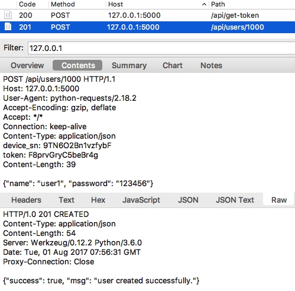
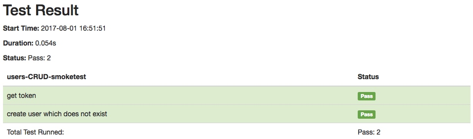

# QuickStart

## Introduction to Sample Interface Service

Along with this project, I devised a sample interface service, and you can use it to familiarize how to play with `HttpRunner`.

This sample service mainly has two parts:

- Authorization, each request of other APIs should sign with some header fields and get token first.
- RESTful APIs for user management, you can do CRUD manipulation on users.

As you see, it is very similar to the mainstream production systems. Therefore once you are familiar with handling this demo service, you can master most test scenarios in your project.

## Launch Sample Interface Service

The demo service is a flask server, we can launch it in this way.

```text
$ export FLASK_APP=tests/api_server.py
$ flask run
 * Serving Flask app "tests.api_server"
 * Running on http://127.0.0.1:5000/ (Press CTRL+C to quit)
```

Now the sample interface service is running, and we can move on to the next step.

## Capture HTTP request and response

Before we write testcases, we should know the details of the API. It is a good choice to use a web debugging proxy tool like `Charles Proxy` to capture the HTTP traffic.

For example, the image below illustrates getting token from the sample service first, and then creating one user successfully.




After thorough understanding of the APIs, we can now begin to write testcases.

## Write the first test case

Open your favorite text editor and you can write test cases like this.

```yaml
- test:
    name: get token
    request:
        url: http://127.0.0.1:5000/api/get-token
        method: POST
        headers:
            user_agent: iOS/10.3
            device_sn: 9TN6O2Bn1vzfybF
            os_platform: ios
            app_version: 2.8.6
        json:
            sign: 19067cf712265eb5426db8d3664026c1ccea02b9

- test:
    name: create user which does not exist
    request:
        url: http://127.0.0.1:5000/api/users/1000
        method: POST
        headers:
            device_sn: 9TN6O2Bn1vzfybF
            token: F8prvGryC5beBr4g
        json:
            name: "user1"
            password: "123456"
    validate:
        - {"check": "status_code", "comparator": "eq", "expect": 201}
        - {"check": "content.success", "comparator": "eq", "expect": true}
```

As you see, each API request is described in a `test` block. And in the `request` field, it describes the detail of HTTP request, includes url, method, headers and data, which are in line with the captured traffic.

You may wonder why we use the `json` field other than `data`. That's because the post data is in `JSON` format, when we use `json` to indicate the post data, we do not have to specify `Content-Type` to be `application/json` in request headers or dump data before request.

Have you recalled some familiar scenes?

Yes! That's what we did in [`requests.request`](requests.request)! Since `HttpRunner` takes full reuse of [`Requests`][requests], it inherits all powerful features of [`Requests`][requests], and we can handle HTTP request as the way we do before.

## Run test cases

Suppose the test case file is named as [`quickstart-demo-rev-0.yml`][quickstart-demo-rev-0] and is located in `examples` folder, then we can run it in this way.

```text
ate examples/demo-rev-0.yml
Running tests...
----------------------------------------------------------------------
 get token ... INFO:root: Start to POST http://127.0.0.1:5000/api/get-token
INFO:root: status_code: 200, response_time: 48 ms, response_length: 46 bytes
OK (0.049669)s
 create user which does not exist ... INFO:root: Start to POST http://127.0.0.1:5000/api/users/1000
ERROR:root: Failed to POST http://127.0.0.1:5000/api/users/1000! exception msg: 403 Client Error: FORBIDDEN for url: http://127.0.0.1:5000/api/users/1000
ERROR (0.006471)s
----------------------------------------------------------------------
Ran 2 tests in 0.056s

FAILED
 (Errors=1)
```

Oops! The second test case failed with 403 status code.

That is because we request with the same data as we captured in `Charles Proxy`, while the `token` is generated dynamically, thus the recorded data can not be be used twice directly.

## Optimize test case: correlation

To fix this problem, we should correlate `token` field in the second API test case, which is also called `correlation`.

```yaml
- test:
    name: get token
    request:
        url: http://127.0.0.1:5000/api/get-token
        method: POST
        headers:
            user_agent: iOS/10.3
            device_sn: 9TN6O2Bn1vzfybF
            os_platform: ios
            app_version: 2.8.6
        json:
            sign: 19067cf712265eb5426db8d3664026c1ccea02b9
    extract:
        - token: content.token
    validate:
        - {"check": "status_code", "comparator": "eq", "expect": 200}
        - {"check": "content.token", "comparator": "len_eq", "expect": 16}

- test:
    name: create user which does not exist
    request:
        url: http://127.0.0.1:5000/api/users/1000
        method: POST
        headers:
            device_sn: 9TN6O2Bn1vzfybF
            token: $token
        json:
            name: "user1"
            password: "123456"
    validate:
        - {"check": "status_code", "comparator": "eq", "expect": 201}
        - {"check": "content.success", "comparator": "eq", "expect": true}
```

As you see, the `token` field is no longer hardcoded, instead it is extracted from the first API request with `extract` mechanism. In the meanwhile, it is assigned to `token` variable, which can be referenced by the subsequent API requests.

Now we save the test cases to [`quickstart-demo-rev-1.yml`][quickstart-demo-rev-1] and rerun it, and we will find that both API requests to be successful.

## Optimize test case: parameterization

Let's look back to our test set `quickstart-demo-rev-1.yml`, and we can see the `device_sn` field is still hardcoded. This may be quite different from the actual scenarios.

In actual scenarios, each user's `device_sn` is different, so we should parameterize the request parameters, which is also called `parameterization`. In the meanwhile, the `sign` field is calculated with other header fields, thus it may change significantly if any header field changes slightly.

However, the test cases are only `YAML` documents, it is impossible to generate parameters dynamically in such text. Fortunately, we can combine `Python` scripts with `YAML/JSON` test cases in `HttpRunner`.

To achieve this goal, we can utilize `debugtalk.py` plugin and `variables` mechanisms.

To be specific, we can create a Python file (`examples/debugtalk.py`) and implement the related algorithm in it. The `debugtalk.py` file can not only be located beside `YAML/JSON` testset file, but also can be in any upward recursive folder. Since we want `debugtalk.py` to be importable, we should put a `__init__.py` in its folder to make it as a Python module.

```python
import hashlib
import hmac
import random
import string

SECRET_KEY = "DebugTalk"

def get_sign(*args):
    content = ''.join(args).encode('ascii')
    sign_key = SECRET_KEY.encode('ascii')
    sign = hmac.new(sign_key, content, hashlib.sha1).hexdigest()
    return sign

def gen_random_string(str_len):
    random_char_list = []
    for _ in range(str_len):
        random_char = random.choice(string.ascii_letters + string.digits)
        random_char_list.append(random_char)

    random_string = ''.join(random_char_list)
    return random_string
```

And then, we can revise our demo test case and reference the functions. Suppose the revised file named [`quickstart-demo-rev-2.yml`][quickstart-demo-rev-2].

```yaml
- test:
    name: get token
    variables:
        - user_agent: 'iOS/10.3'
        - device_sn: ${gen_random_string(15)}
        - os_platform: 'ios'
        - app_version: '2.8.6'
    request:
        url: http://127.0.0.1:5000/api/get-token
        method: POST
        headers:
            user_agent: $user_agent
            device_sn: $device_sn
            os_platform: $os_platform
            app_version: $app_version
        json:
            sign: ${get_sign($user_agent, $device_sn, $os_platform, $app_version)}
    extract:
        - token: content.token
    validate:
        - {"check": "status_code", "comparator": "eq", "expect": 200}
        - {"check": "content.token", "comparator": "len_eq", "expect": 16}

- test:
    name: create user which does not exist
    request:
        url: http://127.0.0.1:5000/api/users/1000
        method: POST
        headers:
            device_sn: $device_sn
            token: $token
        json:
            name: "user1"
            password: "123456"
    validate:
        - {"check": "status_code", "comparator": "eq", "expect": 201}
        - {"check": "content.success", "comparator": "eq", "expect": true}
```

In this revised test case, `variable reference` and `function invoke` mechanisms are both used.

To make fields like `device_sn` can be used more than once, we bind values to variables in `variables` block. When we bind variables, we can not only bind exact value to a variable name, but also can call a function and bind the evaluated value to it.

When we want to reference a variable in the test case, we can do this with a escape character `$`. For example, `$user_agent` will not be taken as a normal string, and `HttpRunner` will consider it as a variable named `user_agent`, search and return its binding value.

When we want to reference a function, we shall use another escape character `${}`. Any content in `${}` will be considered as function calling, so we should guarantee that we call functions in the right way. At the same time, variables can also be referenced as parameters of function.

## Optimize test case: overall config block

There is still one issue unsolved.

The `device_sn` field is defined in the first API test case, thus it may be impossible to reference it in other test cases. Context separation is a well-designed mechanism, and we should obey this good practice.

To handle this case, overall `config` block is supported in `HttpRunner`. If we define variables or import functions in `config` block, these variables and functions will become global and can be referenced in the whole test set.

```yaml
# examples/quickstart-demo-rev-3.yml
- config:
    name: "smoketest for CRUD users."
    variables:
        - device_sn: ${gen_random_string(15)}
    request:
        base_url: http://127.0.0.1:5000
        headers:
            device_sn: $device_sn

- test:
    name: get token
    variables:
        - user_agent: 'iOS/10.3'
        - os_platform: 'ios'
        - app_version: '2.8.6'
    request:
        url: /api/get-token
        method: POST
        headers:
            user_agent: $user_agent
            os_platform: $os_platform
            app_version: $app_version
        json:
            sign: ${get_sign($user_agent, $device_sn, $os_platform, $app_version)}
    extract:
        - token: content.token
    validate:
        - {"check": "status_code", "comparator": "eq", "expect": 200}
        - {"check": "content.token", "comparator": "len_eq", "expect": 16}

- test:
    name: create user which does not exist
    request:
        url: /api/users/1000
        method: POST
        headers:
            token: $token
        json:
            name: "user1"
            password: "123456"
    validate:
        - {"check": "status_code", "comparator": "eq", "expect": 201}
        - {"check": "content.success", "comparator": "eq", "expect": true}
```

As you see, we define variables in `config` block. Also, we can set `base_url` in `config` block, thereby we can specify relative path in each API request url. Besides, we can also set common fields in `config` `request`, such as `device_sn` in headers.

Until now, the test cases are finished and each detail is handled properly.

## Run test cases and generate report

Finally, let's run test set [`quickstart-demo-rev-3.yml`][quickstart-demo-rev-3] once more.

```text
$ ate examples/quickstart-demo-rev-4.yml
Running tests...
----------------------------------------------------------------------
 get token ... INFO:root: Start to POST http://127.0.0.1:5000/api/get-token
INFO:root: status_code: 200, response_time: 33 ms, response_length: 46 bytes
OK (0.037027)s
 create user which does not exist ... INFO:root: Start to POST http://127.0.0.1:5000/api/users/1000
INFO:root: status_code: 201, response_time: 15 ms, response_length: 54 bytes
OK (0.016414)s
----------------------------------------------------------------------
Ran 2 tests in 0.054s
OK

Generating HTML reports...
Template is not specified, load default template instead.
Reports generated: /Users/Leo/MyProjects/HttpRunner/reports/quickstart-demo-rev-0/2017-08-01-16-51-51.html
```

Great! The test case runs successfully and generates a `HTML` test report.



## Further more

This is just a starting point, see the `advanced guide` for the advanced features.

- templating
- [`data extraction and validation`][extraction-and-validation]
- [`comparator`][comparator]

[requests]: http://docs.python-requests.org/en/master/
[requests.request]: http://docs.python-requests.org/en/master/api/#requests.request
[comparator]: comparator.md
[extraction-and-validation]: extraction-and-validation.md
[quickstart-demo-rev-0]: ../examples/quickstart-demo-rev-0.yml
[quickstart-demo-rev-1]: ../examples/quickstart-demo-rev-1.yml
[quickstart-demo-rev-2]: ../examples/quickstart-demo-rev-2.yml
[quickstart-demo-rev-3]: ../examples/quickstart-demo-rev-3.yml
