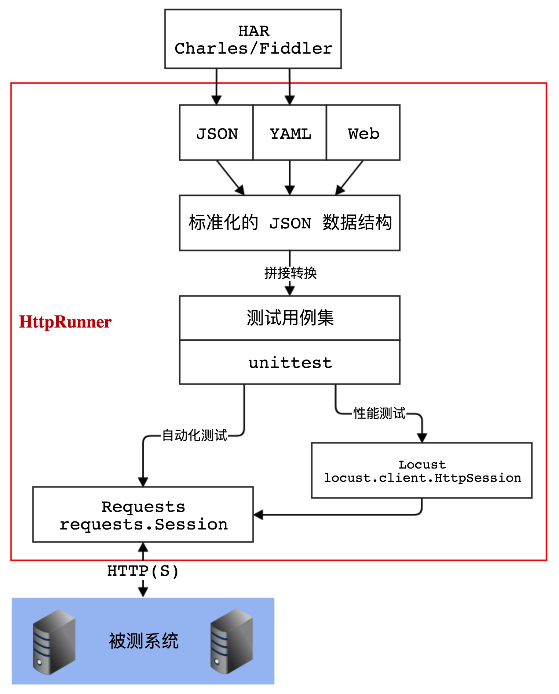

HttpRunner 通过复用 [`Locust`][Locust]，可以在无需对 YAML/JSON 进行任何修改的情况下，直接运行性能测试。

## 原理图



## 安装依赖包

安装完成 HttpRunner 后，系统中会新增`locusts`命令，但不会同时安装 Locust。

在系统中未安装 Locust 的情况下，运行`locusts`命令时会出现如下提示。

```bash
$ locusts -V
WARNING  Locust is not installed, install first and try again.
install command: pip install locustio
```

Locust 的安装方式如下：

```text
$ pip install locustio
```

安装完成后，执行 `locusts -V` 可查看到 Locust 的版本号。

```text
$ locusts -V
[2017-08-26 23:45:42,246] bogon/INFO/stdout: Locust 0.8a2
[2017-08-26 23:45:42,246] bogon/INFO/stdout:
```

执行 `locusts -h`，可查看到使用帮助文档。

```text
$ locusts -h
Usage: locust [options] [LocustClass [LocustClass2 ... ]]

Options:
  -h, --help            show this help message and exit
  -H HOST, --host=HOST  Host to load test in the following format:
                        http://10.21.32.33
  --web-host=WEB_HOST   Host to bind the web interface to. Defaults to '' (all
                        interfaces)
  -P PORT, --port=PORT, --web-port=PORT
                        Port on which to run web host
  -f LOCUSTFILE, --locustfile=LOCUSTFILE
                        Python module file to import, e.g. '../other.py'.
                        Default: locustfile
  --csv=CSVFILEBASE, --csv-base-name=CSVFILEBASE
                        Store current request stats to files in CSV format.
  --master              Set locust to run in distributed mode with this
                        process as master
  --slave               Set locust to run in distributed mode with this
                        process as slave
  --master-host=MASTER_HOST
                        Host or IP address of locust master for distributed
                        load testing. Only used when running with --slave.
                        Defaults to 127.0.0.1.
  --master-port=MASTER_PORT
                        The port to connect to that is used by the locust
                        master for distributed load testing. Only used when
                        running with --slave. Defaults to 5557. Note that
                        slaves will also connect to the master node on this
                        port + 1.
  --master-bind-host=MASTER_BIND_HOST
                        Interfaces (hostname, ip) that locust master should
                        bind to. Only used when running with --master.
                        Defaults to * (all available interfaces).
  --master-bind-port=MASTER_BIND_PORT
                        Port that locust master should bind to. Only used when
                        running with --master. Defaults to 5557. Note that
                        Locust will also use this port + 1, so by default the
                        master node will bind to 5557 and 5558.
  --expect-slaves=EXPECT_SLAVES
                        How many slaves master should expect to connect before
                        starting the test (only when --no-web used).
  --no-web              Disable the web interface, and instead start running
                        the test immediately. Requires -c and -r to be
                        specified.
  -c NUM_CLIENTS, --clients=NUM_CLIENTS
                        Number of concurrent clients. Only used together with
                        --no-web
  -r HATCH_RATE, --hatch-rate=HATCH_RATE
                        The rate per second in which clients are spawned. Only
                        used together with --no-web
  -n NUM_REQUESTS, --num-request=NUM_REQUESTS
                        Number of requests to perform. Only used together with
                        --no-web
  -L LOGLEVEL, --loglevel=LOGLEVEL
                        Choose between DEBUG/INFO/WARNING/ERROR/CRITICAL.
                        Default is INFO.
  --logfile=LOGFILE     Path to log file. If not set, log will go to
                        stdout/stderr
  --print-stats         Print stats in the console
  --only-summary        Only print the summary stats
  --no-reset-stats      Do not reset statistics once hatching has been
                        completed
  -l, --list            Show list of possible locust classes and exit
  --show-task-ratio     print table of the locust classes' task execution
                        ratio
  --show-task-ratio-json
                        print json data of the locust classes' task execution
                        ratio
  -V, --version         show program's version number and exit
```

可以看出，`loucsts` 命令与 `locust` 命令的用法基本相同。

相比于 `locust` 命令，`loucsts`命令主要存在如下两项差异。

## 运行性能测试

在 `-f` 参数后面，`loucsts` 命令不仅可以指定 Locust 支持的 Python 文件，同时可以直接指定 YAML/JSON 格式的测试用例文件。在具体实现上，当 `-f` 指定 YAML/JSON 格式的测试用例文件时，会先将其转换为 Python 格式的 locustfile，然后再将 locustfile.py 传给 locust 命令。

```bash
$ locusts -f examples/first-testcase.yml
[2017-08-18 17:20:43,915] Leos-MacBook-Air.local/INFO/locust.main: Starting web monitor at *:8089
[2017-08-18 17:20:43,918] Leos-MacBook-Air.local/INFO/locust.main: Starting Locust 0.8a2
```

执行上述命令后，即完成了 Locust 服务的启动，后续就可以在 Locust 的 Web 管理界面中进行操作了，使用方式与 Locust 完全相同。

## 多进程运行模式

默认情况下，在 Locust 中如需使用 master-slave 模式启动多个进程（使用多核处理器的能力），只能先启动 master，然后再逐一启动若干个 slave。

```text
$ locust -f locustfile.py --master
$ locust -f locustfile.py --slave &
$ locust -f locustfile.py --slave &
$ locust -f locustfile.py --slave &
$ locust -f locustfile.py --slave &
```

在 HttpRunner 中，新增实现 `--processes` 参数，可以一次性启动 1 个 master 和多个 salve。若在 `--processes` 参数后没有指定具体的数值，则启动的 slave 个数与机器的 CPU 核数相同。

```bash
$ locusts -f examples/first-testcase.yml --processes 4
[2017-08-26 23:51:47,071] bogon/INFO/locust.main: Starting web monitor at *:8089
[2017-08-26 23:51:47,075] bogon/INFO/locust.main: Starting Locust 0.8a2
[2017-08-26 23:51:47,078] bogon/INFO/locust.main: Starting Locust 0.8a2
[2017-08-26 23:51:47,080] bogon/INFO/locust.main: Starting Locust 0.8a2
[2017-08-26 23:51:47,083] bogon/INFO/locust.main: Starting Locust 0.8a2
[2017-08-26 23:51:47,084] bogon/INFO/locust.runners: Client 'bogon_656e0af8e968a8533d379dd252422ad3' reported as ready. Currently 1 clients ready to swarm.
[2017-08-26 23:51:47,085] bogon/INFO/locust.runners: Client 'bogon_09f73850252ee4ec739ed77d3c4c6dba' reported as ready. Currently 2 clients ready to swarm.
[2017-08-26 23:51:47,084] bogon/INFO/locust.main: Starting Locust 0.8a2
[2017-08-26 23:51:47,085] bogon/INFO/locust.runners: Client 'bogon_869f7ed671b1a9952b56610f01e2006f' reported as ready. Currently 3 clients ready to swarm.
[2017-08-26 23:51:47,085] bogon/INFO/locust.runners: Client 'bogon_80a804cda36b80fac17b57fd2d5e7cdb' reported as ready. Currently 4 clients ready to swarm.
```


Enjoy!


[Locust]: http://locust.io/