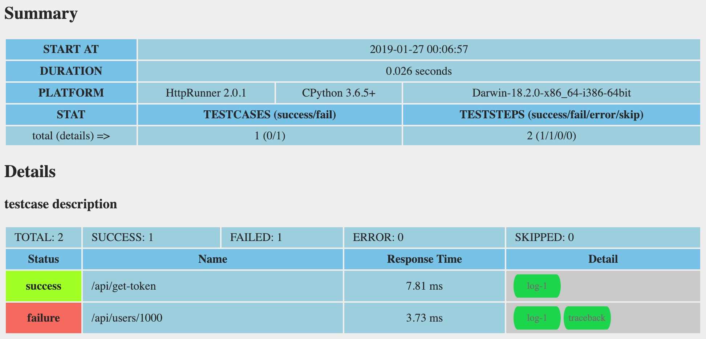
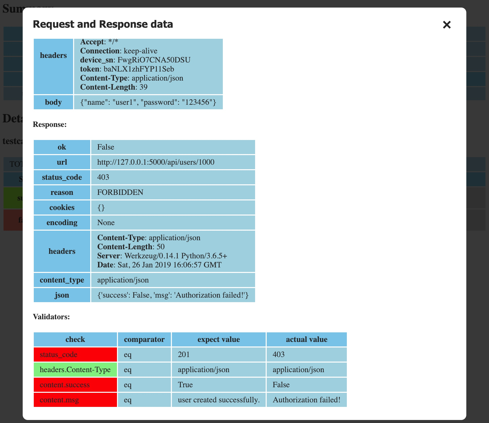
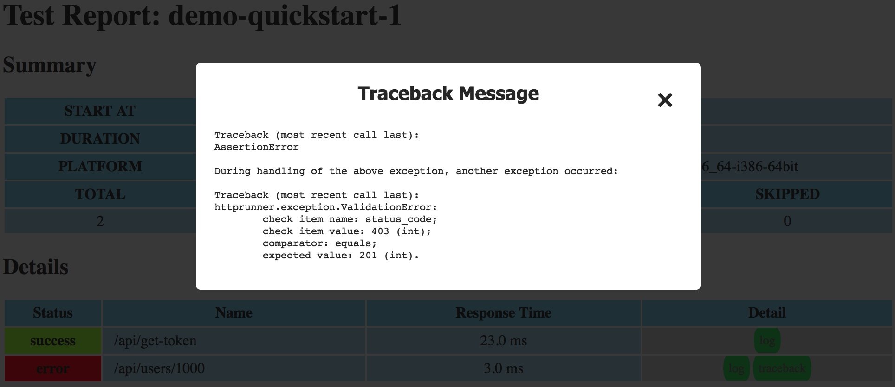

使用 HttpRunner 执行完自动化测试后，会在当前路径的 reports 目录下生成一份 HTML 格式的测试报告。

## 默认情况

默认情况下，生成的测试报告文件会位于项目根目录的 reports 文件夹中，文件名称为测试开始的时间戳。

```bash
$ hrun docs/data/demo-quickstart-6.yml
INFO     Start to run testcase: testcase description
/api/get-token
INFO     POST http://127.0.0.1:5000/api/get-token
INFO     status_code: 200, response_time(ms): 10.05 ms, response_length: 46 bytes

.
/api/users/1548561170497
INFO     POST http://127.0.0.1:5000/api/users/1548561170497
INFO     status_code: 201, response_time(ms): 2.88 ms, response_length: 54 bytes

.

----------------------------------------------------------------------
Ran 2 tests in 0.034s

OK
INFO     Start to render Html report ...
INFO     Generated Html report: /Users/debugtalk/MyProjects/HttpRunner-dev/httprunner-docs-v2x/reports/1548561170.html
```

点击查看[测试报告](/data/reports/1548561170.html)。

## 默认报告样式

在 HttpRunner 中自带了一个 Jinja2 格式的报告模版，默认情况下，生成的报告样式均基于该模版（[httprunner/templates/default_report_template.html][default_report]）。

测试报告形式如下：

在 Summary 中，会罗列本次测试的整体信息，包括测试开始时间、总运行时长、运行的Python版本和系统环境、运行结果统计数据。



在 Details 中，会详细展示每一条测试用例的运行结果。

点击测试用例对应的 log 按钮，会在弹出框中展示该用例执行的详细数据，包括请求的 headers 和 body、响应的 headers 和 body、校验结果、响应、响应耗时（elapsed）等信息。




若测试用例运行不成功（failed/error/skipped），则在该测试用例的 detail 中会出现 traceback 按钮，点击该按钮后，会在弹出框中展示失败的堆栈日志，或者 skipped 的原因。



点击查看[测试报告](/data/reports/1548561464.html)。

## 自定义

除了默认的报告样式，HttpRunner 还支持使用自定义的报告模板。

### 编写自定义模板（Jinja2格式）

自定义模板需要采用 [Jinja2][Jinja2] 的格式，其中可以使用的数据可参考[数据结构示例][summary_data]。

例如，我们需要在自定义模板中展示测试结果的统计数据，就可以采用如下方式进行描述：

```html
<tr>
  <th>TOTAL</th>
  <th>SUCCESS</th>
  <th>FAILED</th>
  <th>ERROR</th>
  <th>SKIPPED</th>
</tr>
<tr>
  <td>{{stat.testsRun}}</td>
  <td>{{stat.successes}}</td>
  <td>{{stat.failures}}</td>
  <td>{{stat.errors}}</td>
  <td>{{stat.skipped}}</td>
</tr>
```

在自定义报告模板时，可以参考 HttpRunner 的[默认报告模板][default_report]，要实现更复杂的模版功能，可参考 [Jinja2][Jinja2] 的使用文档。

### 使用自定义模板

使用自定义模版时，需要通过 `--report-template` 指定报告模板的路径，然后测试运行完成后，就会采用自定义的模板生成测试报告。

```bash
$ hrun docs/data/demo-quickstart-2.yml --report-template /path/to/custom_report_template
...
同上，省略

INFO     render with html report template: /path/to/custom_report_template
INFO     Start to render Html report ...
INFO     Generated Html report: reports/1532078874.html
```

[Jinja2]: http://jinja.pocoo.org/docs/latest
[default_report]: https://github.com/HttpRunner/HttpRunner/blob/master/httprunner/templates/report_template.html
[summary_data]: /development/#_6

### 指定报告生成路径

默认情况下，生成的测试报告文件会位于项目根目录的 reports 文件夹中。如需指定生成报告的路径，可以使用 `--report-dir` 参数。

```bash
$ hrun docs/data/demo-quickstart-2.yml --dirreport-name /other/path/
...
同上，省略

INFO     Start to render Html report ...
INFO     Generated Html report: /other/path/1532078874.html
```
