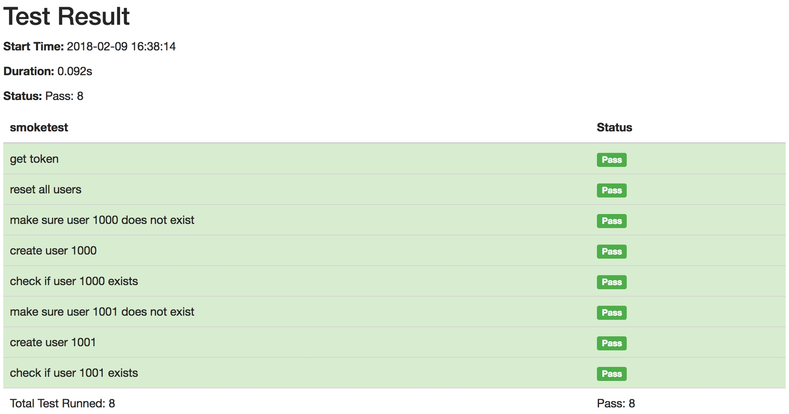

# Hello World

This example shows you how to organize and run testcases in layer.

## file structure

According to rules, all testcase definition files should be placed in `tests` folder, and testing reports will be generated in `reports` folder.

```text
$ cd httprunner/examples/HelloWorld
$ tree .
.
├── README.md
├── reports
│   └── smoketest
│       └── 2018-02-09-16-25-54.html
└── tests
    ├── __init__.py
    ├── api
    │   └── basic.yml
    ├── debugtalk.py
    ├── suite
    │   ├── create_and_check.yml
    │   └── setup.yml
    └── testcases
        └── smoketest.yml
```

## Start server

In order to run test, we need a backend service, and here we will use `api_server` located in our unittests.

```bash
$ cd httprunner
$ export FLASK_APP=tests/api_server.py
$ flask run
 * Serving Flask app "tests.api_server"
 * Running on http://127.0.0.1:5000/ (Press CTRL+C to quit)
```

## run testcases

When you want to run testcases, you should make sure you are in the root directory of your project. In this example, that is the HelloWorld folder path.

```bash
$ cd httprunner/examples/HelloWorld
```

Then, run the testcase with `hrun` command.

```
$ hrun tests/testcases/smoketest.yml
Running tests...
----------------------------------------------------------------------
 get token ... INFO:root: Start to POST http://127.0.0.1:5000/api/get-token
INFO:root: status_code: 200, response_time: 12 ms, response_length: 46 bytes
OK (0.018492)s
 reset all users ... INFO:root: Start to GET http://127.0.0.1:5000/api/reset-all
INFO:root: status_code: 200, response_time: 5 ms, response_length: 17 bytes
OK (0.006153)s
 make sure user 1000 does not exist ... INFO:root: Start to GET http://127.0.0.1:5000/api/users/1000
ERROR:root: Failed to GET http://127.0.0.1:5000/api/users/1000! exception msg: 404 Client Error: NOT FOUND for url: http://127.0.0.1:5000/api/users/1000
OK (0.010638)s
 create user 1000 ... INFO:root: Start to POST http://127.0.0.1:5000/api/users/1000
INFO:root: status_code: 201, response_time: 9 ms, response_length: 54 bytes
OK (0.010303)s
 check if user 1000 exists ... INFO:root: Start to GET http://127.0.0.1:5000/api/users/1000
INFO:root: status_code: 200, response_time: 11 ms, response_length: 66 bytes
OK (0.013168)s
 make sure user 1001 does not exist ... INFO:root: Start to GET http://127.0.0.1:5000/api/users/1001
ERROR:root: Failed to GET http://127.0.0.1:5000/api/users/1001! exception msg: 404 Client Error: NOT FOUND for url: http://127.0.0.1:5000/api/users/1001
OK (0.013631)s
 create user 1001 ... INFO:root: Start to POST http://127.0.0.1:5000/api/users/1001
INFO:root: status_code: 201, response_time: 6 ms, response_length: 54 bytes
OK (0.007490)s
 check if user 1001 exists ... INFO:root: Start to GET http://127.0.0.1:5000/api/users/1001
INFO:root: status_code: 200, response_time: 9 ms, response_length: 66 bytes
OK (0.011435)s

----------------------------------------------------------------------
Ran 8 tests in 0.092s

OK


Generating HTML reports...
Template is not specified, load default template instead.
Reports generated: /Users/debugtalk/MyProjects/HttpRunner-dev/HttpRunner/examples/HelloWorld/reports/smoketest/2018-02-09-16-38-14.html
```

After the running is over, you will get a testing report, which is in HTML format.

```bash
$ open reports/smoketest/2018-02-09-16-38-14.html
```


