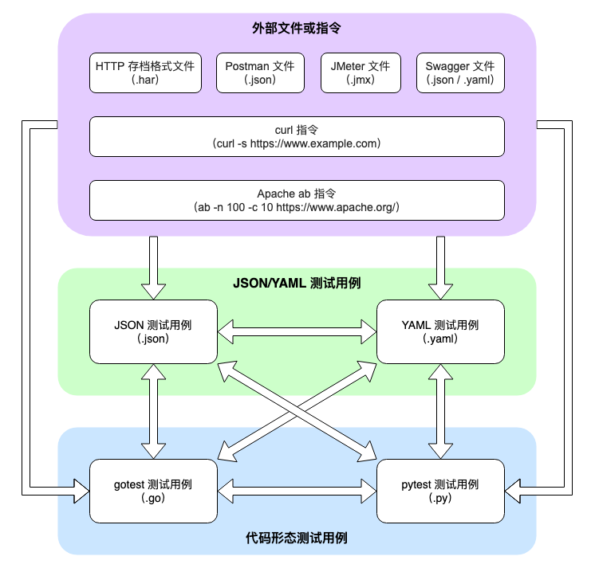

# hrp convert

## 快速上手

```shell
$ hrp convert -h
convert to JSON/YAML/gotest/pytest testcases

Usage:
  hrp convert $path... [flags]

Flags:
  -h, --help                help for convert
  -d, --output-dir string   specify output directory, default to the same dir with har file
  -p, --profile string      specify profile path to override headers (except for auto-generated headers) and cookies
      --to-gotest           convert to gotest scripts (TODO)
      --to-json             convert to JSON scripts (default true)
      --to-pytest           convert to pytest scripts
      --to-yaml             convert to YAML scripts

Global Flags:
      --log-json           set log to json format
  -l, --log-level string   set log level (default "INFO")
```

`hrp convert` 指令用于将 HAR/Postman/JMeter/Swagger 文件或 curl/Apache ab 指令转化为 JSON/YAML/gotest/pytest 形态的测试用例，同时也支持测试用例各个形态之间的相互转化。

该指令所有选项的详细说明如下：

1. `--to-json / --to-yaml / --to-gotest / --to-pytest` 用于将输入转化为对应形态的测试用例，四个选项中最多只能指定一个，如果不指定则默认会将输入转化为 JSON 形态的测试用例
2. `--output-dir` 后接测试用例的期望输出目录的路径，用于将转换生成的测试用例输出到对应的文件夹
3. `--profile` 后接 profile 配置文件的路径，目前支持替换（不存在则会创建）或者覆盖输入的外部脚本/测试用例中的 `Headers` 和 `Cookies` 信息，profile 文件的后缀可以为 `json/yaml/yml`，下面给出两类 profile 配置文件的示例：
- 根据 profile 替换指定的 `Headers` 和 `Cookies` 信息
```yaml
headers:
  Header1: "this header will be created or updated"
cookies:
  Cookie1: "this cookie will be created or updated"
```
- 根据 profile 覆盖原有的 `Headers` 和 `Cookies` 信息
```yaml
override: true
headers:
  Header1: "all original headers will be overridden"
cookies:
  Cookie1: "all original cookies will be overridden"
```

## 注意事项

1. 输出的测试用例文件名格式为 `Postman 工程文件名称（不带拓展名）` + `_test` + `.json/.yaml/.go/.py 后缀`，如果该文件已经存在则会进行覆盖
2. `hrp convert` 可以自动识别输入类型，因此不需要通过选项来手动制定输入类型，如遇到无法识别、不支持或转换失败的情况，则会输出错误日志并跳过，不会影响其他转换过程的正常进行
3. 在 profile 文件中，指定 `override` 字段为 `false/true` 可以选择修改模式为替换/覆盖。需要注意的是，如果不指定该字段则 profile 的默认修改模式为替换模式
4. 输入为 JSON/YAML 测试用例时，良好兼容 Golang/Python 双引擎的请求体、断言格式细微差异，输出的 JSON/YAML 则统一采用 Golang 引擎的风格


## 转换流程图

`hrp convert` 的转换过程流程图如下：


## 开发进度

`hrp convert` 当前的开发进度如下：

| from \ to | JSON | YAML | GoTest | PyTest |
|:---------:|:----:|:----:|:------:|:------:|
|    HAR    |  ✅   |  ✅   |   ❌    |   ✅    |
|  Postman  |  ✅   |  ✅   |   ❌    |   ✅    |
|  JMeter   |  ❌   |  ❌   |   ❌    |   ❌    |
|  Swagger  |  ❌   |  ❌   |   ❌    |   ❌    |
|   curl    |  ❌   |  ❌   |   ❌    |   ❌    |
| Apache ab |  ❌   |  ❌   |   ❌    |   ❌    |
|   JSON    |  ✅   |  ✅   |   ❌    |   ✅    |
|   YAML    |  ✅   |  ✅   |   ❌    |   ✅    |
|  GoTest   |  ❌   |  ❌   |   ❌    |   ❌    |
|  PyTest   |  ❌   |  ❌   |   ❌    |   ❌    |